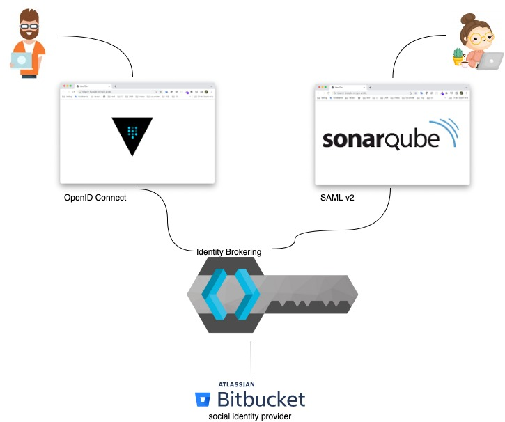

# Keycloak used as identity broker 
This repository contains terraform scripts for configuring:
* Keycloak as an Identity broker 
* Bitbucket as an Identity provider
* Sonarqube as a client using SAML protocol
* Vault as a client using OpenID Connect protocol

### Prerequisites
Keycloak has to be added as an [OAuth consumer in Bitbucket](https://support.atlassian.com/bitbucket-cloud/docs/integrate-another-application-through-oauth/). 

1. Navigate to https://bitbucket.org/.
2. Choose a workspace -> Settings -> OAuth consumers
3. Enter name
4. As a callback URL enter: *{keycloak url}/auth/realms/{realm name}/broker/bitbucket/endpoint*
5. Set read account permissions

After you press the button save you will see Key and Secret. The key and secret have to be set as values to variables: **bitbucket_client_id** and **bitbucket_client_secret**.  

Add values to the following variables defined in [tf/variables.tf](tf/variables.tf):
* keycloak_url
* keycloak_user
* keycloak_password
* keycloak_url
* keycloak_realm
* display_name
* default_group
* bitbucket_client_id
* bitbucket_client_secret

### Terraform modules

#### [keycloak-realm](tf/keycloak-realm)
Creates Keycloak realm\
**Documentation**: https://www.keycloak.org/docs/latest/server_admin/#proc-creating-a-realm_server_administration_guide

#### [keycloak-idp-bitbucket](tf/)
Adds Bitbucket as an Identity provider\
**Documentation**: https://www.keycloak.org/docs/latest/server_admin/#bitbucket

#### [keycloak-saml-sonarqube](tf/) 
Adds Sonarqube as a client using SAML protocol\
**Documentation**: https://docs.sonarqube.org/latest/instance-administration/delegated-auth/

#### [sonarqube](tf/)
Adding SAML authentication in Sonarqube (sonar.auth.saml.certificate.secured has to be manually added, it is not supported by the Terraform module)\
**Documentation**: https://docs.sonarqube.org/latest/instance-administration/delegated-auth/

#### [keycloak-openid-vault](tf/)
Adds Vault as a client using OpenID Connect protocol\
**Documentation**: https://www.vaultproject.io/docs/auth/jwt/oidc-providers/keycloak

#### [vault](tf/)
Adds OpenID Connect authentication in Vault